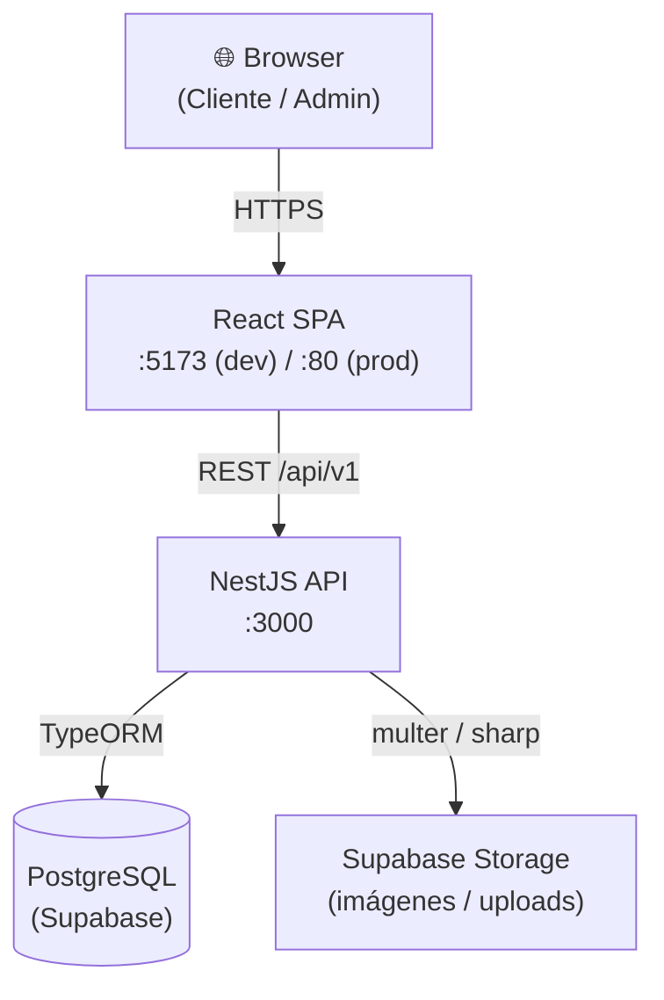
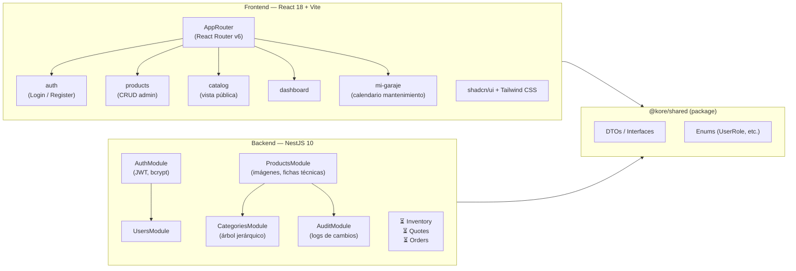
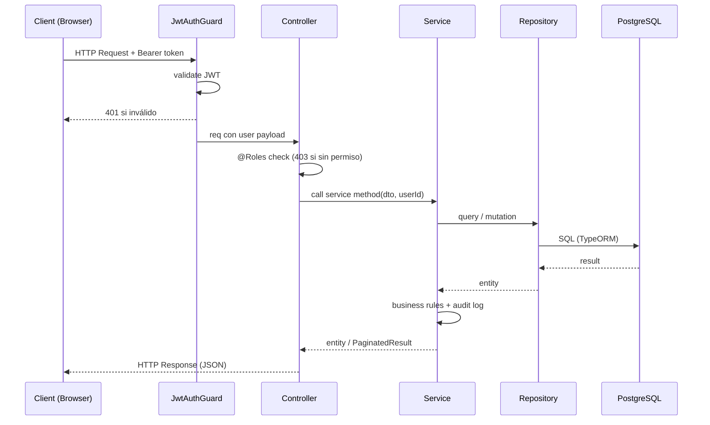
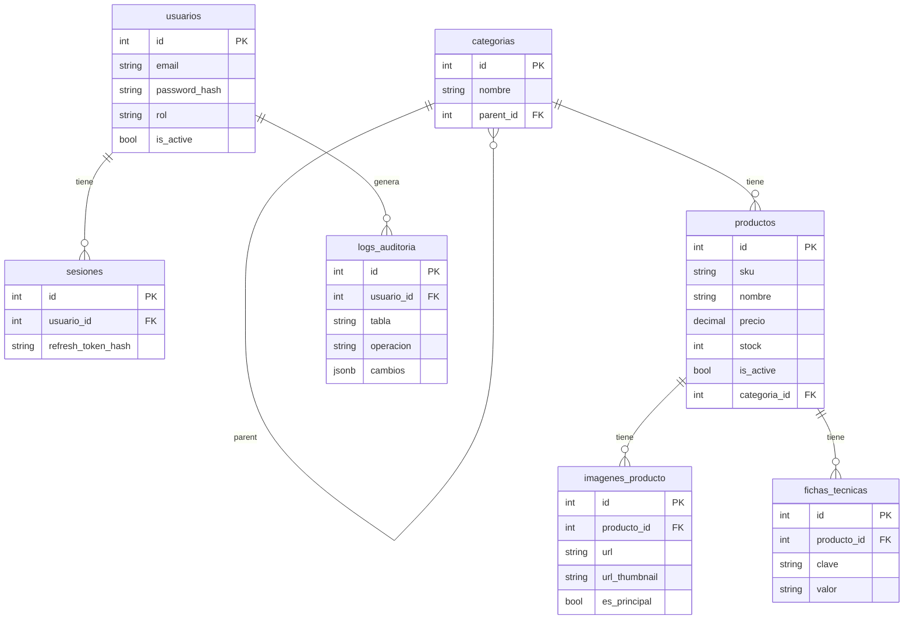
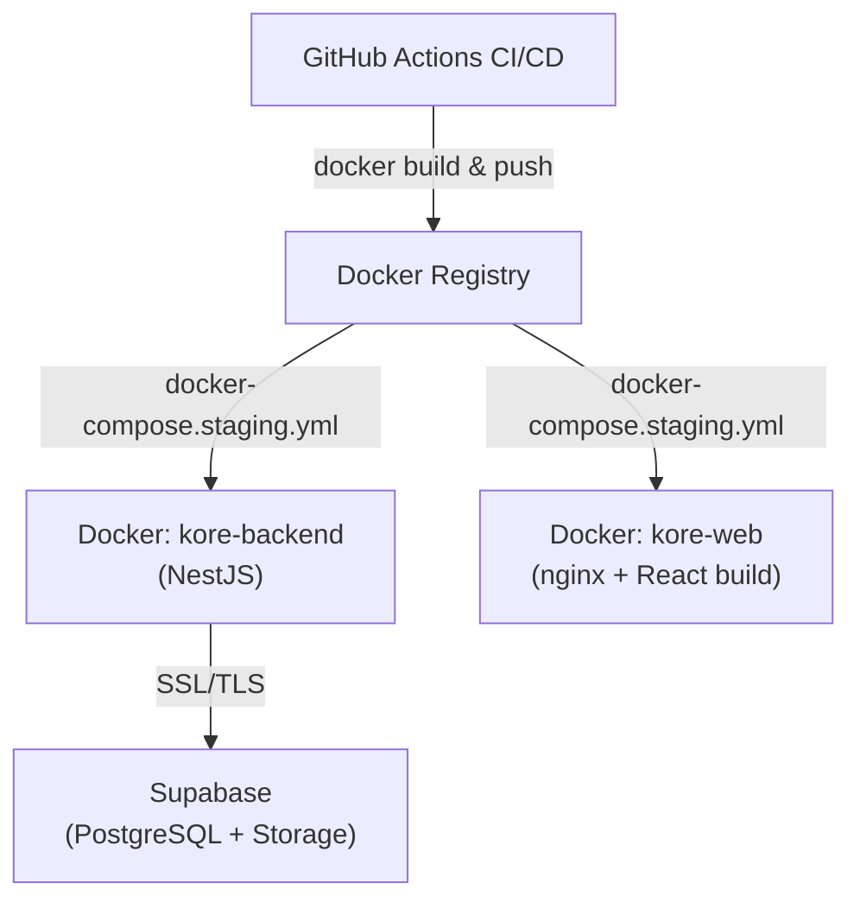

# Kore Repuestos — Architecture Diagram

## System Context

```mermaid
graph TD
    Browser["🌐 Browser\n(Cliente / Admin)"]
    Web["React SPA\n:5173 (dev) / :80 (prod)"]
    API["NestJS API\n:3000"]
    DB[("PostgreSQL\n(Supabase)")]
    Storage["Supabase Storage\n(imágenes / uploads)"]

    Browser -->|"HTTPS"| Web
    Web -->|"REST /api/v1"| API
    API -->|"TypeORM"| DB
    API -->|"multer / sharp"| Storage
```

## Component Diagram

```mermaid
graph LR
    subgraph Frontend ["Frontend — React 18 + Vite"]
        Router["AppRouter\n(React Router v6)"]
        AuthFeature["auth\n(Login / Register)"]
        ProductsFeature["products\n(CRUD admin)"]
        CatalogFeature["catalog\n(vista pública)"]
        DashboardFeature["dashboard"]
        MiGaraje["mi-garaje\n(calendario mantenimiento)"]
        UI["shadcn/ui + Tailwind CSS"]
    end

    subgraph Backend ["Backend — NestJS 10"]
        AuthModule["AuthModule\n(JWT, bcrypt)"]
        UsersModule["UsersModule"]
        ProductsModule["ProductsModule\n(imágenes, fichas técnicas)"]
        CategoriesModule["CategoriesModule\n(árbol jerárquico)"]
        AuditModule["AuditModule\n(logs de cambios)"]
        PendingModules["⏳ Inventory\n⏳ Quotes\n⏳ Orders"]
    end

    subgraph Shared ["@kore/shared (package)"]
        DTOs["DTOs / Interfaces"]
        Enums["Enums (UserRole, etc.)"]
    end

    Router --> AuthFeature & ProductsFeature & CatalogFeature & DashboardFeature & MiGaraje
    Frontend --> Shared
    Backend --> Shared
    AuthModule --> UsersModule
    ProductsModule --> CategoriesModule
    ProductsModule --> AuditModule
```

## Request Lifecycle

```mermaid
sequenceDiagram
    participant C as Client (Browser)
    participant Guard as JwtAuthGuard
    participant Ctrl as Controller
    participant Svc as Service
    participant Repo as Repository
    participant DB as PostgreSQL

    C->>Guard: HTTP Request + Bearer token
    Guard->>Guard: validate JWT
    Guard-->>C: 401 si inválido
    Guard->>Ctrl: req con user payload
    Ctrl->>Ctrl: @Roles check (403 si sin permiso)
    Ctrl->>Svc: call service method(dto, userId)
    Svc->>Repo: query / mutation
    Repo->>DB: SQL (TypeORM)
    DB-->>Repo: result
    Repo-->>Svc: entity
    Svc->>Svc: business rules + audit log
    Svc-->>Ctrl: entity / PaginatedResult
    Ctrl-->>C: HTTP Response (JSON)
```

## Data Model (simplified)

```mermaid
erDiagram
    usuarios {
        int id PK
        string email
        string password_hash
        string rol
        bool is_active
    }
    sesiones {
        int id PK
        int usuario_id FK
        string refresh_token_hash
    }
    categorias {
        int id PK
        string nombre
        int parent_id FK
    }
    productos {
        int id PK
        string sku
        string nombre
        decimal precio
        int stock
        bool is_active
        int categoria_id FK
    }
    imagenes_producto {
        int id PK
        int producto_id FK
        string url
        string url_thumbnail
        bool es_principal
    }
    fichas_tecnicas {
        int id PK
        int producto_id FK
        string clave
        string valor
    }
    logs_auditoria {
        int id PK
        int usuario_id FK
        string tabla
        string operacion
        jsonb cambios
    }

    usuarios ||--o{ sesiones : "tiene"
    categorias ||--o{ categorias : "parent"
    categorias ||--o{ productos : "tiene"
    productos ||--o{ imagenes_producto : "tiene"
    productos ||--o{ fichas_tecnicas : "tiene"
    usuarios ||--o{ logs_auditoria : "genera"
```

## Infrastructure (Staging / Production)

```mermaid
graph TD
    GH["GitHub Actions CI/CD"]
    DockerHub["Docker Registry"]
    BackendContainer["Docker: kore-backend\n(NestJS)"]
    WebContainer["Docker: kore-web\n(nginx + React build)"]
    Supabase["Supabase\n(PostgreSQL + Storage)"]

    GH -->|"docker build & push"| DockerHub
    DockerHub -->|"docker-compose.staging.yml"| BackendContainer
    DockerHub -->|"docker-compose.staging.yml"| WebContainer
    BackendContainer -->|"SSL/TLS"| Supabase
```
